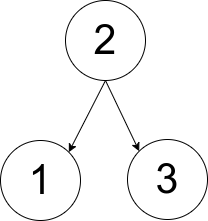

## 1719.重构一棵树的方案数-困难

给你一个数组 `pairs` ，其中 <code>pairs[i] = [xi, yi]</code> ，并且满足：  

  * `pairs` 中没有重复元素  
  * <code>xi < yi</code>  

令 `ways` 为满足下面条件的有根树的方案数：  
  * 树所包含的所有节点值都在 `pairs` 中。  
  * 一个数对 <code>[xi, yi]</code> 出现在 `pairs` 中 **当且仅当** <code>xi</code> 是 <code>yi</code> 的祖先或者 <code>yi</code> 是 <code>xi</code> 的祖先 。  
  * **注意**：构造出来的树不一定是二叉树。  

两棵树被视为不同的方案当存在至少一个节点在两棵树中有不同的父节点。  

请你返回：

  * 如果 `ways == 0` ，返回 `0` 。  
  * 如果 `ways == 1` ，返回 `1` 。  
  * 如果 `ways > 1` ，返回 `2` 。  

一棵 **有根树** 指的是只有一个根节点的树，所有边都是从根往外的方向。

我们称从根到一个节点路径上的任意一个节点（除去节点本身）都是该节点的 **祖先** 。根节点没有祖先。 
 

**示例 1：**

<pre>
<b>输入：</b>pairs = [[1,2],[2,3]]
<b>输出：</b>1
<b>解释：</b>如上图所示，有且只有一个符合规定的有根树。
</pre>

 

**示例 2：**

<pre>
<b>输入：</b>pairs = [[1,2],[2,3],[1,3]]
<b>输出：</b>2
<b>解释：</b>有多个符合规定的有根树，其中三个如上图所示。
</pre>

 

**示例 3：**

<pre>
<b>输入：</b>pairs = [[1,2],[2,3],[2,4],[1,5]]
<b>输出：</b>0
<b>解释：</b>没有符合规定的有根树。
</pre>

 

**提示：**

- <code>1 <= pairs.length <= 105</code>
- <code>1 <= xi < yi <= 500</code>
- `pairs` 中的元素互不相同。